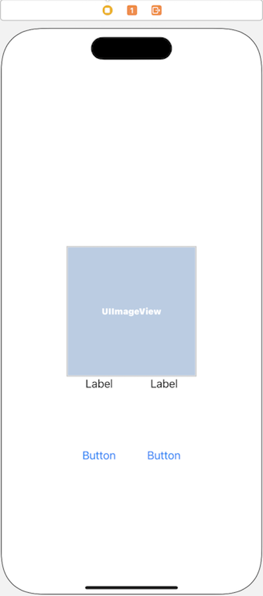
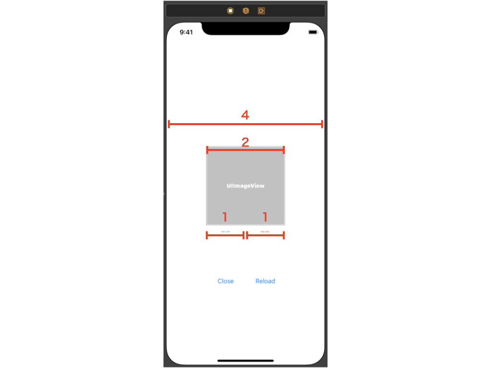
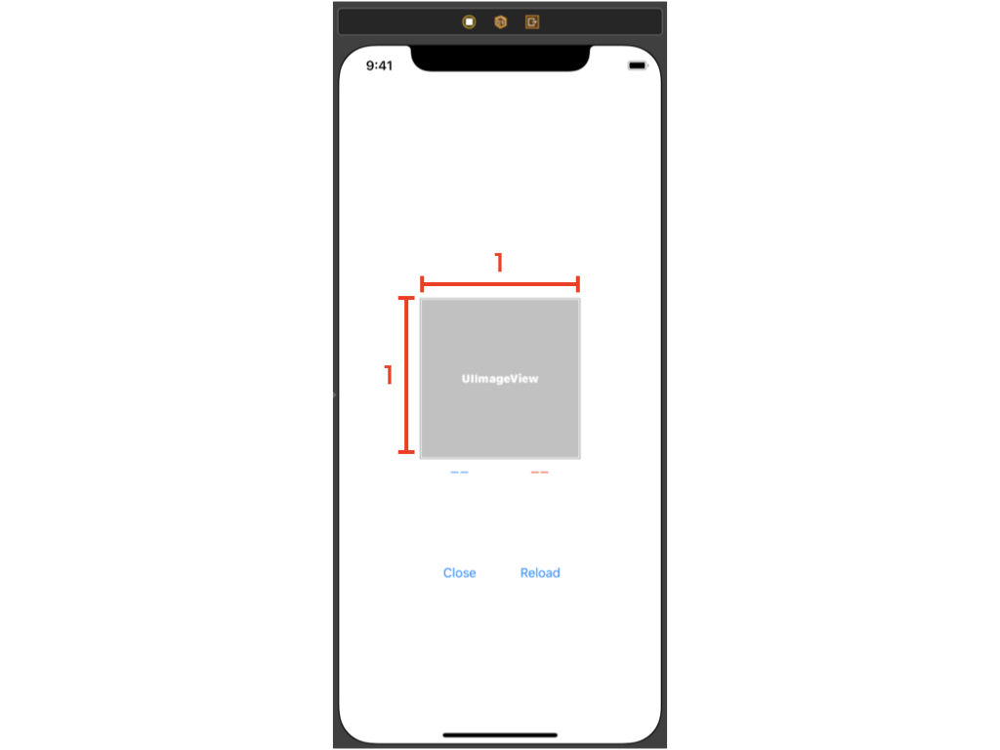
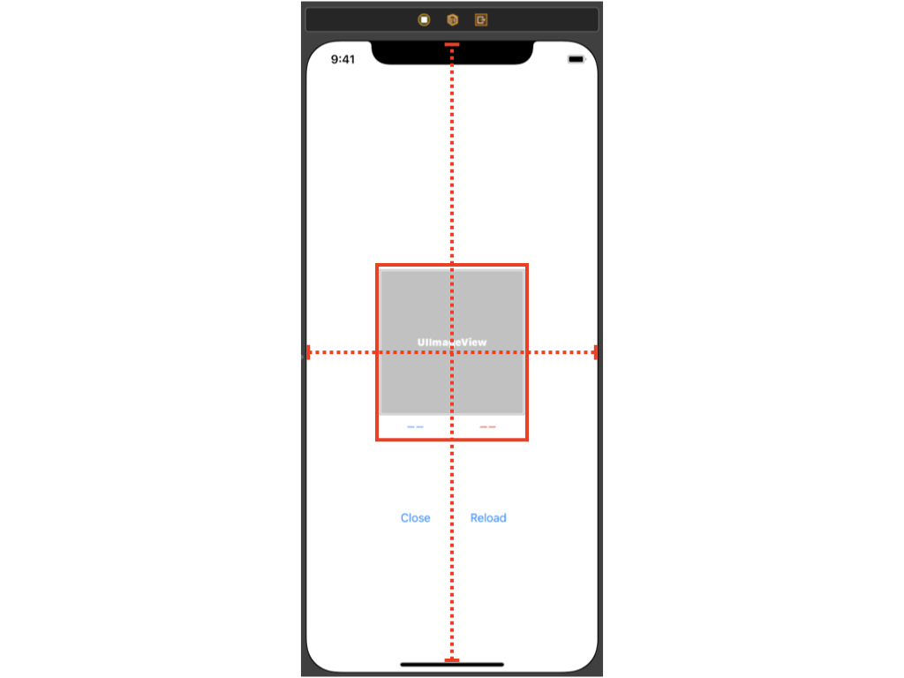
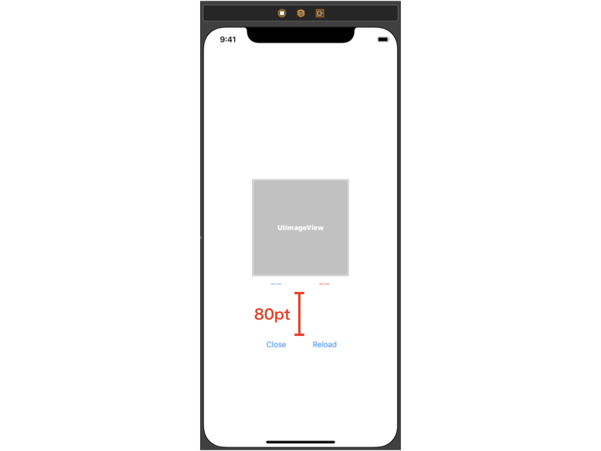
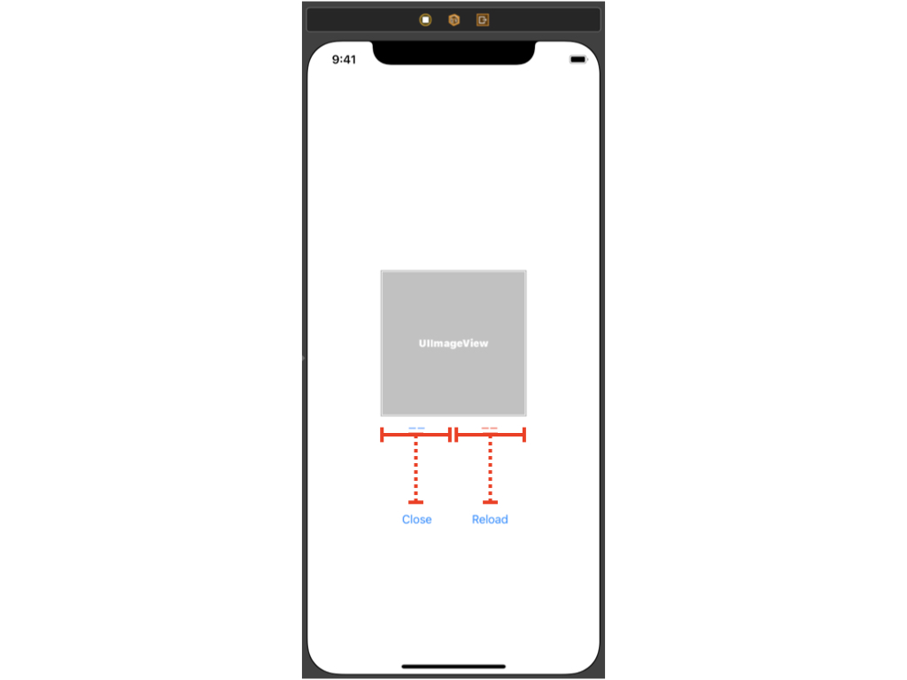

# AutoLayout で UI を作成する

view のレイアウトは、AutoLayout という仕組みで構築します。  
NSLayoutConstraint オブジェクトで表現される**制約**を組み合わせることで、view のレイアウトを作成します。  
表示したい view のサイズや位置関係、view 同士の幅などを制約で制御する、ということです。

AutoLayout はコードで実装することは勿論、Interface Builder から GUI で構築することもできます。  
`.storyboard`ファイルや、`.xib`ファイルが該当します。

ここでは、`main.storyboard`ファイルで実際に AutoLayout を使って UI を作成してみましょう。

AutoLayout の詳細については、下記のリファレンスを確認してください。  
[Auto Layout Guide](https://developer.apple.com/library/archive/documentation/UserExperience/Conceptual/AutolayoutPG/index.html#//apple_ref/doc/uid/TP40010853-CH7-SW1)

Interface Builder の使い方については、下記のセッションで解説されています。  
[Working with Constraints in Interface Builder](https://developer.apple.com/library/archive/documentation/UserExperience/Conceptual/AutolayoutPG/WorkingwithConstraintsinInterfaceBuidler.html#//apple_ref/doc/uid/TP40010853-CH10-SW1)

## 課題

下記の UI を構築してみましょう。

完成イメージ

Interface Builder を用いて、main.storyboard に実装してください。  
コードベースで実装しても構いません。

◾️ ポイント１  
・UIImageView の幅は UIViewController の幅の半分  
・青字の UILabel と赤字の UILabel の幅は UIImageView の半分  
・青字の UILabel の左端は、UIImageView の左端と一致  
・赤字の UILabel の右端は、UIImageView の右端と一致  
・UILabel はの文字は中央揃えする  
・UIImageView と UILabel の隙間はあけない

◾️ ポイント 2  
・UIImageView の高さと幅は同じ

◾️ ポイント 3  
UIImageView の水平中央は UIViewController の中央と同じ  
UIImageView と UILabel を合わせた矩形の垂直中央は UIViewController の中央と同じ

◾️ ポイント 4  
・UIButton と UILabel の隙間は 80pt

◾️ ポイント 5  
・UIButton と UILabel の水平中央は同じ

作成後、実際にビルドして画面を確認してみましょう。

参考：(App/impl-swift-trainig/AutoLayoutTasks)
