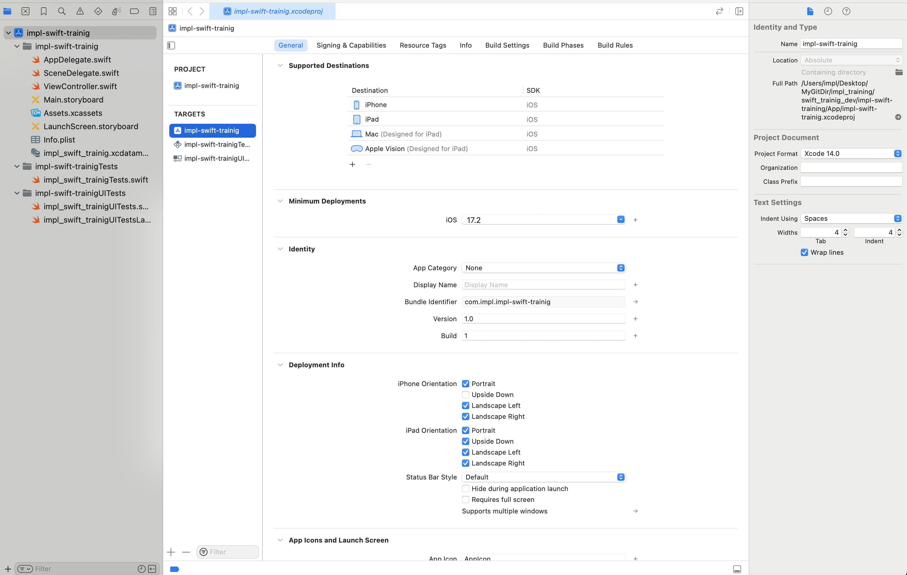
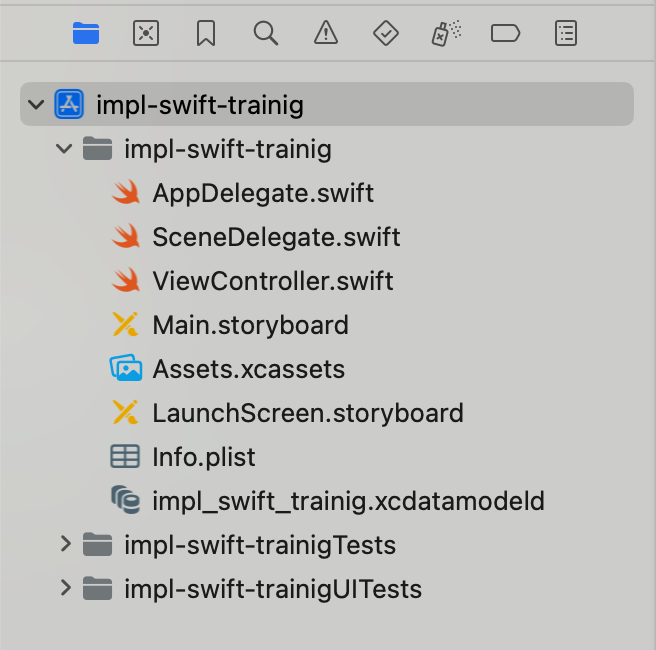

# ファイル構成

クローンしたプロジェクトを Xcode で Open し、基本的なファイル構成と設定ファイルについて確認していきましょう。

## 初期ファイルの確認(UIKit)

Xcode を立ち上げ、`Open Existing Project`を選択してください。  
クローンした App ディレクトリから、`impl-swift-trainig.xcodeproj`を選択し、プロジェクトを Open します。

## ファイルについて

プロジェクトナビゲーターに表示されているファイルについて確認しましょう。  
プロジェクトを新規に作成すると、大体下記のようなファイル構成でプロジェクトが作成されます。

[^1]

ここでは、重要なファイルについてピックアップして解説します。

## AppDelegate.swift

UIKit を使用する場合に生成されるファイルです。
AppDelegate とは、アプリケーション(App)が実行すべきタスクを、代わりに具現する(Delegate)という意味です。  
アプリケーションが実行すべきタスクとは、下記の様な処理があります。

- アプリの初期化
- アプリの環境設定(Configuration)
- アプリ外で発生したイベントに対応
- Apple プッシュ通知サービスなど、実行時に要求されるすべてのサービス登録
- etc

また、UILifecycle(UI の表示)を AppDelegate の責務としている場合、後述の UILifecycle に関する処理がこのファイルで実装されている場合があります。  
現時点では、アプリの起動や初期化で最初に実行されるファイル、という認識で問題ありません。

## SceneDelegate.swift

UIKit を使用する場合に生成されるファイルです。
iOS13 以降、iPadOS においてマルチウィンドウの概念が導入され、一つの画面の中に、2 つのアプリを分割して表示することが出来るようになりました。  
マルチウィンドウに対応するため、Xcode11 から新規生成されたファイルで、UILifecycle に関する処理を実装するファイルです。  
UILifecycle とは、下記の様な処理があります。

- 最初に表示する画面を生成する
- アプリがバックグラウンドへ移行したことを検知する
- アプリがフォアグラウンドへ復帰したことを検知する
- etc

前述の通り、iPadOS におけるマルチウィンドウへの対応で導入されたファイルです。  
アプリのターゲットが iOS であれば、利用してしないケース[^2]があります。  
その場合、UILifecycle に関する処理は AppDelegate.swift に記述します。

ここでは、タブレットかつマルチウィンドウへ対応するアプリの場合に、UI の表示を実装するファイル、という認識で問題ありません。  
(Lifecycle に関しては別の章で解説します。)

## info.plist

アプリに関する基本的な情報や設定を管理するファイルです。拡張子は.plist で、PropertyList の略称です。
[公式ドキュメント](https://developer.apple.com/documentation/bundleresources/information_property_list)
アプリアイコンの下に表示される名称や、アプリバージョン等を設定することが出来ます。

[^1]: ファイル一覧を確認できるこのエリアを、プロジェクトナビゲーターと呼びます。タブを操作することで、ナビゲーターを切り替えることができます。
[^2]: UIKit を用いる場合、AppDelegate は必須ファイルですが、SceneDelegate は必須ファイルではありません。後者に実装する処理を、前者に内包することができます。
