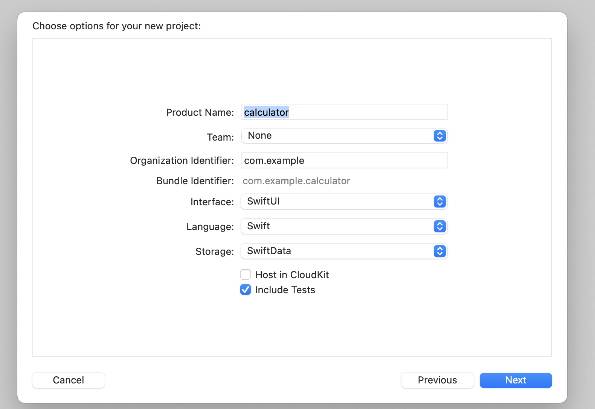

# プロジェクトにXCTestを導入する

さて、実際にXCTestを実装してみましょう。
多少でもプログラムを書いた経験のある皆さんは、身構える必要は全くないです。
実際に書いてみると、XCTestの導入は案外簡単なことに気づかれるのではないかなと想像しています。

本トレーニングでは以下のテストを実装します。

- イニシャライザでプロパティが期待通りインスタンス化されていることを確認するテスト
- ある値と、ある値が一致することを確認するテスト
- ある値がnilであることを確認するテスト
- あるフローがなんらかの例外をスローすることを期待するテスト

トレーニングが終わる頃には、「なんとなくテスト書けそうな気がするぞ」という手応えを獲得できることを保証します!

# 事前準備：テスト対象のプロジェクトを作成する

Xcodeを立ち上げ、新規にプロジェクトを作成します。
忘れずに、「Include Tests」にチェックをつけてください。

プロジェクトを立ち上げると以下の画像の状態になっているはずです。
これで、テストを書く準備が整いました。
