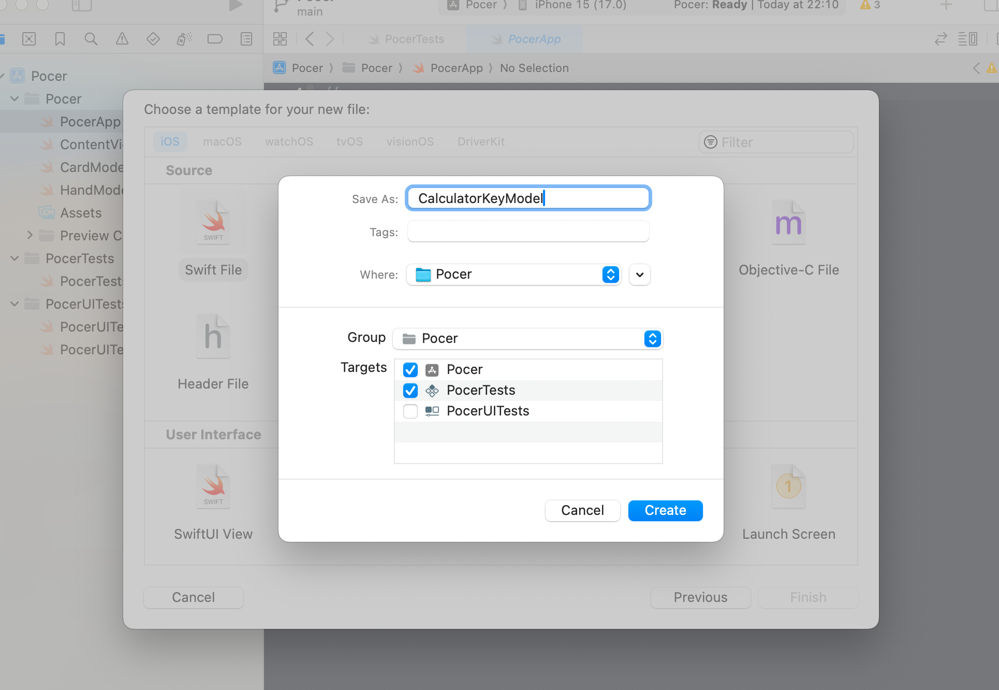
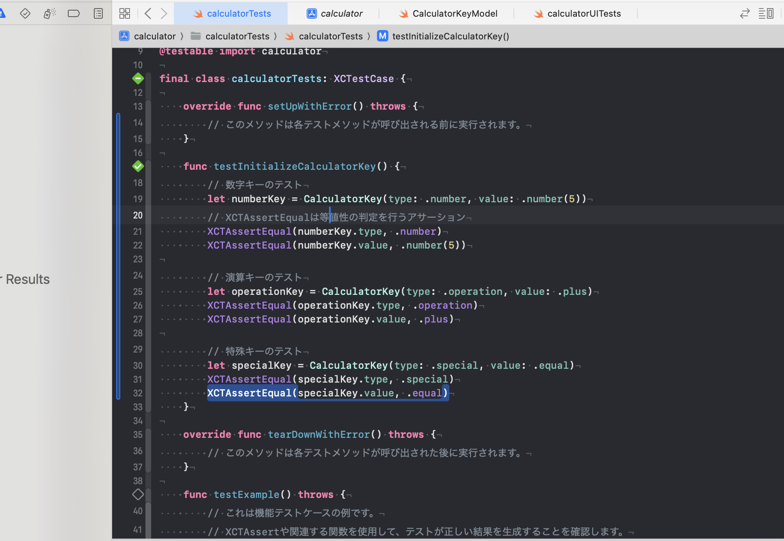
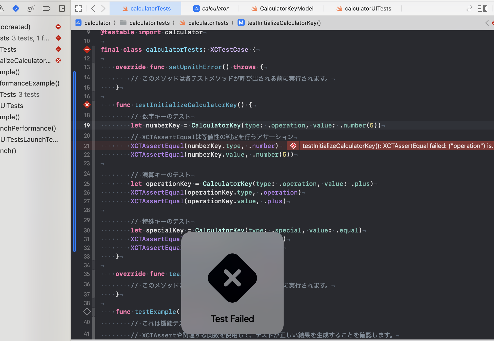

# イニシャライザでプロパティが期待通りインスタンス化されていることを確認するテスト

さて、まずはXTestを実装・実行する流れを体感しましょう。

これからあなたには、電卓を実装してもらいます。
電卓といえば、数字のキーとファンクションキーがありますね。
この2種類のキーを抽象化したモデルを作ってみましょう。
こちらを、本トレーニングのテスト対象とします。

## テスト対象を作成する
ナビゲーションエリア左下のプラスボタンをクリックし、新規にファイルを作成します。
CalculatorKeyModelと命名しました。


数字のキーは0から9まで、ファンクションキーは「+」「-」「=」などの演算キーが該当します。

テスト対象となる、CalculatorKeyを実装しました。
```swift
struct CalculatorKey {
    
    // キーの種類を表す列挙型
    enum KeyType {
        case number  // 数字キー
        case operation // 演算キー
        case special // 特殊キー（クリアやイコールなど）
    }
    
    // キーの値を表す列挙型
    enum KeyValue: Equatable {
        case number(Int)  // 数字キー
        case plus, minus, multiply, divide  // 演算キー
        case equal, clear  // 特殊キー
    }
    
    let type: KeyType
    let value: KeyValue
}
```

## テストを実装する

次に、イニシャライザが正しくプロパティを設定しているか確認するテストを実装します。
今回は、テストが動くことを確認したいので、そこまでちゃんと意味を把握しなくて大丈夫です。

以下のテストコードでは、CalculatorKeyのインスタンスが正しく初期化されていることを確認しています。

```swift
    // イニシャライザでプロパティが期待通りにインスタンス化されているかを確認
    func testInitializeCalculatorKey() {
        // 数字キーのテスト
        let numberKey = CalculatorKey(type: .number, value: .number(5))
        XCTAssertEqual(numberKey.type, .number)
        XCTAssertEqual(numberKey.value, .number(5))

        // 演算キーのテスト
        let operationKey = CalculatorKey(type: .operation, value: .plus)
        XCTAssertEqual(operationKey.type, .operation)
        XCTAssertEqual(operationKey.value, .plus)

        // 特殊キーのテスト
        let specialKey = CalculatorKey(type: .special, value: .equal)
        XCTAssertEqual(specialKey.type, .special)
        XCTAssertEqual(specialKey.value, .equal)
    }
```
テスト対象と、テストコードの実装が完了しました！


## テストを実行する

それではテストを実行してみましょう！
コード左にある菱形っぽいオブジェクトをクリックすることで、テストを実行します。


成功したテストはグリーン・失敗したテストはレッドになります。




テストを実装し、実行する一連の流れをサラッと流してみました。

次から、本格的にテストコードの実装に入ります！