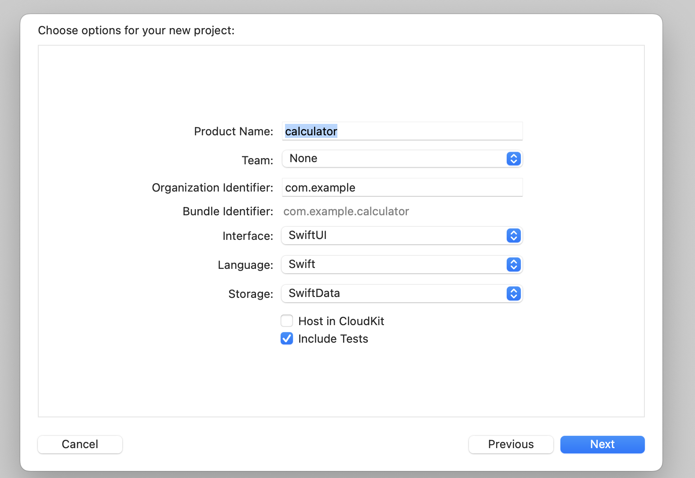

# 実践編

さて、実際にXCTestを実装してみましょう。
多少でもプログラムを書いた経験のある皆さんは、身構える必要は全くないです。
実際に書いてみると、XCTestの導入は案外簡単なことに気づかれるのではないかなと想像しています。

本トレーニングでは以下のテストを実装します。

- イニシャライザでプロパティが期待通りインスタンス化されていることを確認するテスト
- ある値と、ある値が一致することを確認するテスト
- ある値がnilであることを確認するテスト
- あるフローがなんらかの例外をスローすることを期待するテスト

トレーニングが終わる頃には、「なんとなくテスト書けそうな気がするぞ」という手応えを獲得できることを保証します。
それでは書いていきましょう！

# プロジェクトにXCTestを導入する
さて、テスト対象のプロジェクトを新規に作成しましょう。
Xcodeを立ち上げ、新規にプロジェクトを作成します。
忘れずに、「Include Tests」にチェックをつけてください。


# イニシャライザでプロパティが期待通りインスタンス化されていることを確認するテスト
これからあなたには、電卓を実装してもらいます。
電卓といえば、数字のキーとファンクションキーがありますね。
この2種類のキーを抽象化したモデルを作ってみましょう。
数字のキーは0から9まで、ファンクションキーは「+」「-」「=」などの演算キーが該当します。

テスト対象のstructを定義してみました。

```swift
struct CalculatorKey {
    
    // キーの種類を表す列挙型
    enum KeyType {
        case number  // 数字キー
        case operation // 演算キー
        case special // 特殊キー（クリアやイコールなど）
    }
    
    // キーの値を表す列挙型
    enum KeyValue: Equatable {
        case number(Int)  // 数字キー
        case plus, minus, multiply, divide  // 演算キー
        case equal, clear  // 特殊キー
    }
    
    let type: KeyType
    let value: KeyValue
}
```

次に、イニシャライザが正しくプロパティを設定しているか確認するテストを実装します。
以下のテストコードでは、CalculatorKeyのインスタンスが正しく初期化されていることを確認しています。

```swift
    // イニシャライザでプロパティが期待通りにインスタンス化されているかを確認
    func testInitializeCalculatorKey() {
        // 数字キーのテスト
        let numberKey = CalculatorKey(type: .number, value: .number(5))
        XCTAssertEqual(numberKey.type, .number)
        XCTAssertEqual(numberKey.value, .number(5))

        // 演算キーのテスト
        let operationKey = CalculatorKey(type: .operation, value: .plus)
        XCTAssertEqual(operationKey.type, .operation)
        XCTAssertEqual(operationKey.value, .plus)

        // 特殊キーのテスト
        let specialKey = CalculatorKey(type: .special, value: .equal)
        XCTAssertEqual(specialKey.type, .special)
        XCTAssertEqual(specialKey.value, .equal)
    }
```

それではテストを実行してみましょう！
コード左にある菱形っぽいオブジェクトをクリックすることで、テストを実行します。

成功したテストはグリーン・失敗したテストは赤になります。

